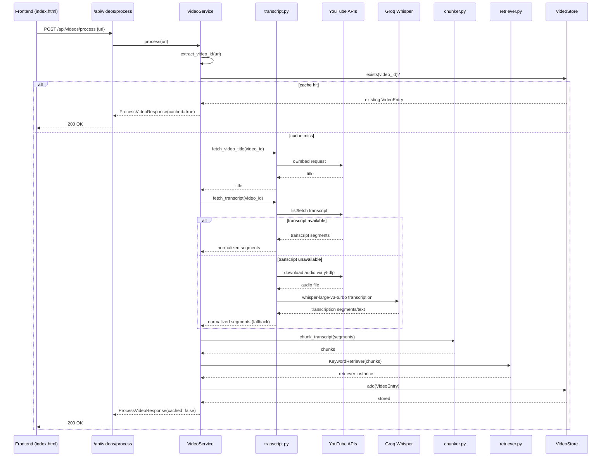
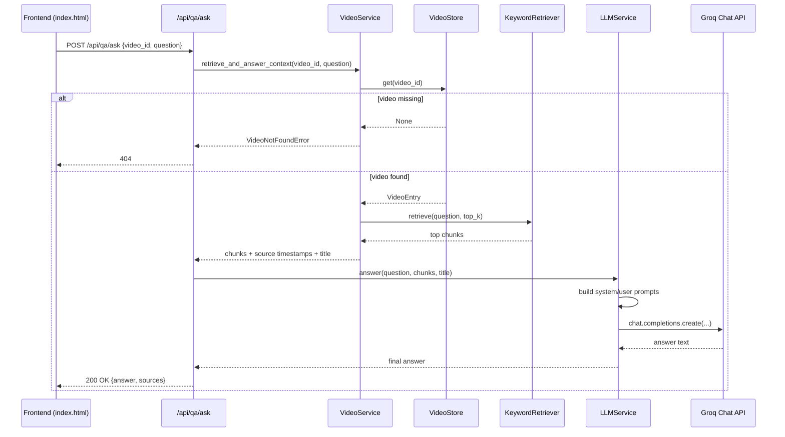

## VideoMind: YouTube RAG Q&A with FastAPI + Groq

VideoMind is a production-style Retrieval-Augmented Generation (RAG) application for YouTube videos.
It indexes transcript content, retrieves the most relevant chunks for a question, and generates answers with source timestamps using Groq LLM.

The project includes:
- FastAPI backend with typed schemas and clean service boundaries
- Single-page frontend for indexing videos and asking questions
- Modular RAG pipeline (transcript -> chunk -> retrieve -> answer)
- Transcript resiliency with multi-stage fallback, including Groq Whisper transcription

## Key Features

- Process YouTube URLs and build a searchable in-memory video index
- Ask natural-language questions against indexed transcript context
- Return timestamped sources for answer traceability
- English-first transcript strategy with language fallback
- Optional transcript auto-translation to English
- Whisper fallback when transcript APIs fail:
	- Download audio with `yt-dlp`
	- Transcribe via Groq `whisper-large-v3-turbo`
- Structured error handling and clean API responses

## RAG Architecture

### 1) Ingestion and Transcript Layer

`app/rag/transcript.py` handles transcript acquisition with this strategy:

1. Try generated English transcript
2. Try manual English transcript
3. Fallback to any available transcript language
4. Optionally translate non-English transcript to English
5. If transcript API fails, fallback to Whisper:
	 - Download audio from YouTube
	 - Transcribe with Groq Whisper
	 - Normalize output to internal segment shape

Internal transcript segment format:

```json
{
	"text": "segment text",
	"start": 12.34,
	"duration": 2.15
}
```

### 2) Chunking Layer

`app/rag/chunker.py` converts transcript segments to overlapping chunks.

- Word-based chunking
- Configurable chunk size and overlap
- Preserves timing metadata per chunk
- Generates `timestamp_str` for UI source chips

Core output object:

```python
Chunk(
	id: int,
	text: str,
	start_time: float,
	end_time: float,
	timestamp_str: str  # MM:SS
)
```

### 3) Retrieval Layer

`app/rag/retriever.py` implements a lightweight TF-IDF-style keyword retriever.

- Lowercase tokenization + stopword filtering
- IDF scoring per token across chunks
- Exact phrase bonus for better precision
- Returns top-k relevant chunks in timeline order

### 4) Generation Layer

`app/services/llm.py` sends retrieved context and user question to Groq chat completions.

- Strong system prompt to constrain answers to provided context
- User prompt includes transcript context and question
- Returns model answer + source timestamps from retrieval

### 5) Storage and Service Composition

- `app/rag/store.py`: in-memory `VideoStore`
- `app/services/video.py`: orchestrates processing flow
- `app/api/routes/*.py`: typed API routes for process/list/delete/ask/health
- `app/app.py`: app factory, lifespan wiring, dependency injection

## System Flow

### Video Processing (`POST /api/videos/process`)

1. Parse YouTube video ID from URL
2. Return cached entry if already indexed
3. Fetch transcript (native transcript flow or Whisper fallback)
4. Chunk transcript
5. Build retriever
6. Store `VideoEntry` in memory
7. Return metadata for UI

### Question Answering (`POST /api/qa/ask`)

1. Validate indexed video exists
2. Retrieve top-k relevant chunks
3. Build LLM prompt with transcript context
4. Generate answer via Groq
5. Return answer + timestamp sources

## Sequence Diagrams

### Video Processing Flow



### Q&A Flow



## Project Structure

```text
app/
	api/
		dependencies.py
		schemas.py
		routes/
			health.py
			qa.py
			videos.py
	core/
		config.py
		exceptions.py
		logging.py
	rag/
		chunker.py
		retriever.py
		store.py
		transcript.py
	services/
		llm.py
		video.py
static/
	index.html
main.py
```

## API Endpoints

- `GET /api/health`
	- Service status, version, and number of indexed videos

- `POST /api/videos/process`
	- Body: `{ "url": "https://www.youtube.com/watch?v=..." }`
	- Response: `video_id`, `title`, `chunk_count`, `transcript_length`, `indexed_at`, `cached`

- `GET /api/videos`
	- List indexed videos

- `DELETE /api/videos/{video_id}`
	- Remove indexed video

- `POST /api/qa/ask`
	- Body: `{ "video_id": "...", "question": "..." }`
	- Response: `answer`, `sources` (timestamps)

Interactive docs:
- `http://localhost:8000/api/docs`
- `http://localhost:8000/api/redoc`

## Configuration

Create `.env` in project root.

```dotenv
GROQ_API_KEY=your_groq_api_key_here
GROQ_MODEL=llama-3.3-70b-versatile

APP_HOST=0.0.0.0
APP_PORT=8000
APP_DEBUG=true

CHUNK_SIZE=400
CHUNK_OVERLAP=60
TOP_K_CHUNKS=5

TRANSCRIPT_AUTO_TRANSLATE_TO_EN=true
TRANSCRIPT_WHISPER_FALLBACK_ENABLED=true
TRANSCRIPT_WHISPER_MODEL=whisper-large-v3-turbo
```

## Local Development

### Option A: using `uv` (recommended)

```bash
uv sync
uv run python main.py
```

### Option B: using `pip`

```bash
python -m venv .venv
.venv\Scripts\activate
pip install -r requirements.txt
python main.py
```

Open:
- UI: `http://localhost:8000/`
- API docs: `http://localhost:8000/api/docs`

## Example API Usage

### Process a video

```bash
curl -X POST http://localhost:8000/api/videos/process \
	-H "Content-Type: application/json" \
	-d "{\"url\":\"https://www.youtube.com/watch?v=dQw4w9WgXcQ\"}"
```

### Ask a question

```bash
curl -X POST http://localhost:8000/api/qa/ask \
	-H "Content-Type: application/json" \
	-d "{\"video_id\":\"dQw4w9WgXcQ\",\"question\":\"What are the key points?\"}"
```

## Error Model

Typed HTTP exceptions are defined in `app/core/exceptions.py`.

- `422`: invalid YouTube URL
- `424`: transcript unavailable
- `404`: video not indexed
- `502`: LLM request failure

## Current Limitations

- In-memory store only: indexed data resets when server restarts
- Retriever is keyword-based (non-embedding)
- Whisper fallback adds latency and API/audio processing cost
- No persistent job queue for long transcription workloads

## Suggested Production Upgrades

- Persistent store (Redis/Postgres)
- Embedding retriever + vector DB (Chroma/PGVector)
- Background worker for ingestion/transcription
- Caching and request throttling
- Observability (structured logs, tracing, metrics)

## License

Choose and add a project license (MIT, Apache-2.0, etc.) if this repository will be shared publicly.
